# Windows--VMwareWorkstation--HAOS环境搭建以及配置

> 该文章分为两个部分
>
> 1. HAOS(home aaistant OS)的安装
> 2. HAOS加载项的配置

## HAOS(home aaistant OS)的安装

> 这里提供三种版本的vmdk文件，百度网盘链接(通过网盘分享的文件：HAOS
> 链接: https://pan.baidu.com/s/1f8w6Bb74UntJs_TcF1J7xQ?pwd=b7xj 提取码: b7xj 
> --来自百度网盘超级会员v4的分享)

使用魔法点击官方Github链接([Releases · home-assistant/operating-system](https://github.com/home-assistant/operating-system/releases))

下载任意版本的vmdk文件,本文章选择 `haos_ova-16.2.rc1.vmdk`

> 1.打开vmware，左上角File->New Virtual Machine Wizard


> 2.点击Next进入下一个界面

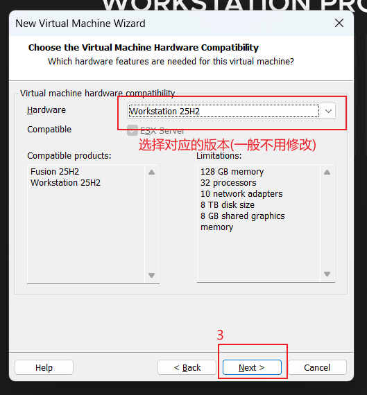

> 3.点击Next进入下一个界面


> 4.点击Next进入下一个界面

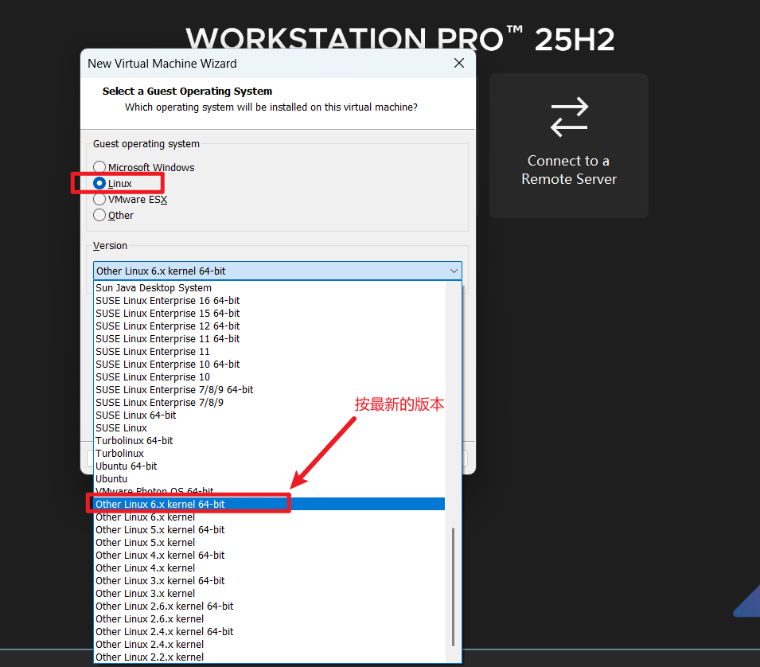

> 5.点击Next进入下一个界面

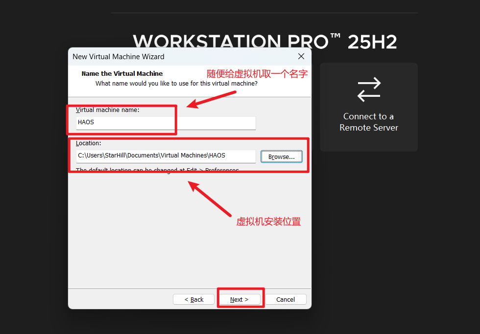

> 6.点击Next进入下一个界面

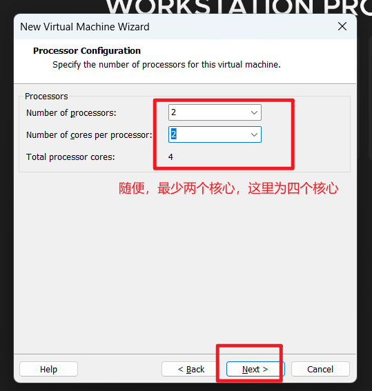

> 7.点击Next进入下一个界面

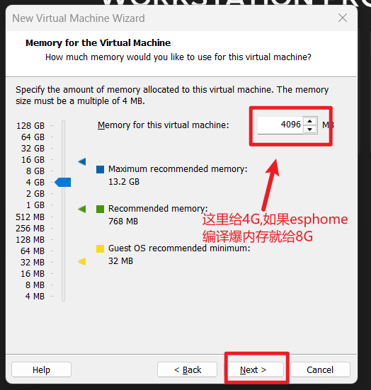

> 8.Next


> 9.点击Next进入下一个界面


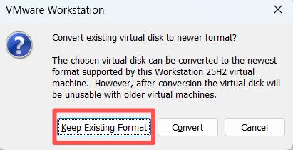

> 10.Finish

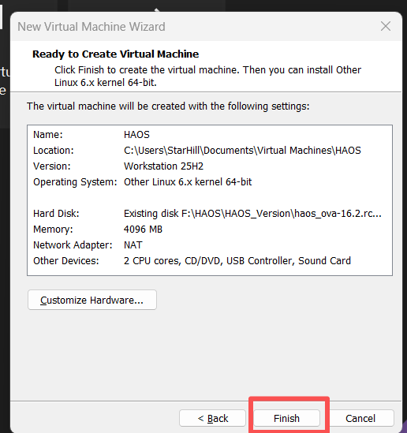

> 11.左侧找到刚刚创建的HAOS(名字无所谓)，右键找到设置(Settings)

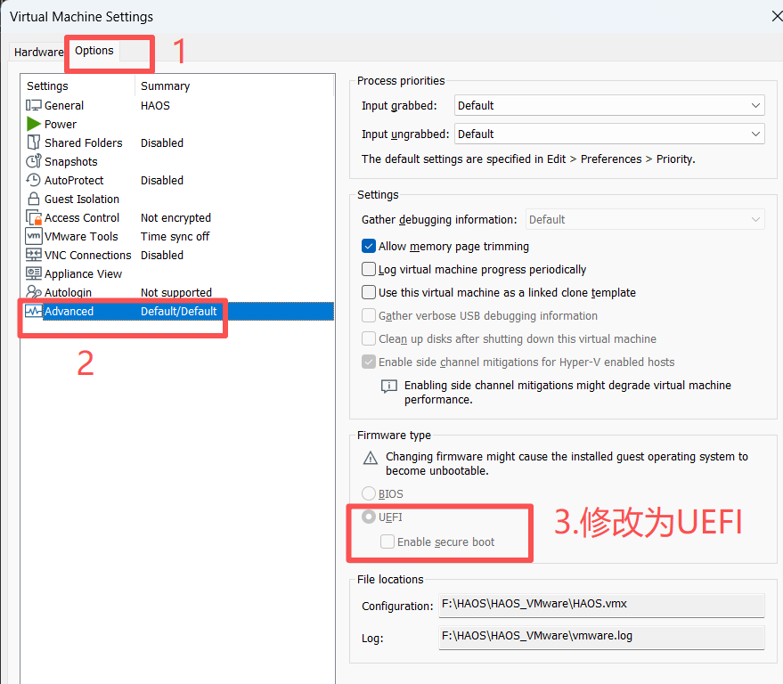

> 12.安装完成

---

!!!注意！！！主机切换连接手机热点 `头硬的可以不用切换热点直接启动` 随后打开魔法

> 点击启动，稍等片刻(好一点硬件的两三分钟，稍逊一点的五分钟左右)，看到下面界面，浏览器输入 `192.168.158.130.8123` 


## HAOS加载项的配置

> 13.进去界面显示等待20分钟或者更长时间，等待,查看日志，日志往上看，如果出现连接不上github的红色报错，建议先等候，这里网络要求非常严格，超过十分钟则重新启动虚拟机中的HAOS，节点换一换看看能不能通过这个等候二十分钟  (手机热点十秒钟直接进)，输入用户名字密码地址等等信息，来到主界面

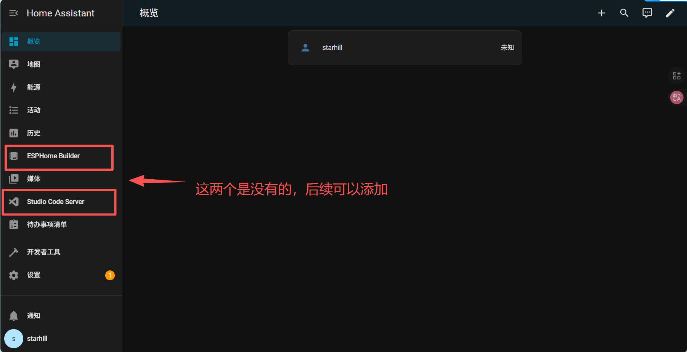

> 14.点击左侧导航栏最下面的用户，进入设置，打开高级模式，再到导航栏中找到设置，右侧有加载项，进入加载项，右下角出现加载项商店，搜索或者是往下找到  `ESPHome Device Builder` ,点击安装，安装完成后，也可以选择添加至侧边栏

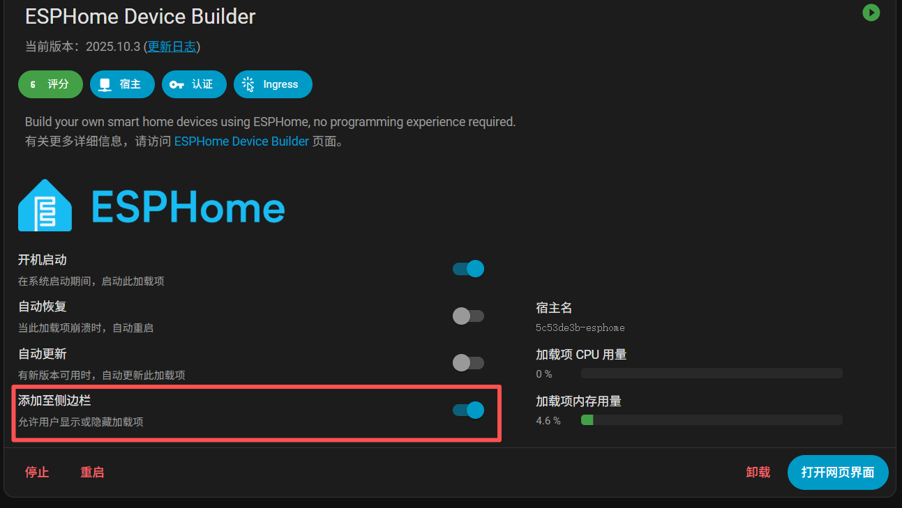

> 15.侧边栏点击进入esphome,右下角->NEW DEVICE->CONTINUE->New Device Setup->起个名字->选择自己的芯片型号

这里是esp32s3,名字是aaa,点击EDIT，编辑yaml文件


原始代码：

```yaml
esphome:
  name: aaa
  friendly_name: aaa

esp32:
  board: esp32-s3-devkitc-1
  framework:
    type: esp-idf

# Enable logging
logger:

# Enable Home Assistant API
api:
  encryption:
    key: "7dhkfmiHcriH34Jq8M0UCqDlsmY8gXD4cFb3Nc9Hohw="

ota:
  - platform: esphome
    password: "73012db6c4a4f9204720504897379d4d"

wifi:
  ssid: !secret wifi_ssid
  password: !secret wifi_password

  # Enable fallback hotspot (captive portal) in case wifi connection fails
  ap:
    ssid: "Aaa Fallback Hotspot"
    password: "W2MmTya4DqQO"

captive_portal:
    
```

原始代码中的wifi修改为可以连接wifi

```yaml
wifi:
  ssid: !secret wifi_ssid
  password: !secret wifi_password
  
修改可以连接的wifi账密：
wifi:
  ssid: 123456
  password: 123456
```

修改wifi后在yaml文件的最后加入以下代码

```yaml
# ---------------- DHT11 ----------------
sensor:
  - platform: dht
    pin: GPIO13
    temperature:
      name: "Temperature"
    humidity:
      name: "Humidity"
    update_interval: 5s
    model: "DHT11"
```

> 正常方法(看不到进度):
> 第一次利用USB数据线烧录，点击右上角的INSTALL->选二个 `Plug into this computer` -> 等一会 preparing download… 
>
> 非正常方法(能看到进度):
> 点击右上角的INSTALL->选一个 `Wirelessly` 

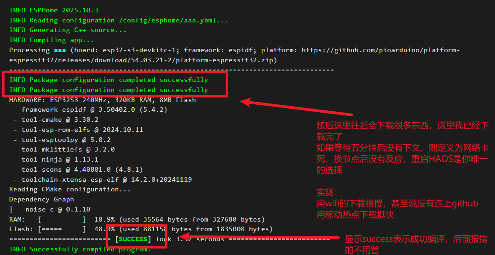

点击CLOSE,再次选择INSTAll的第二个方式，等待十秒钟左右的 preparing download… ，点击preparing download…  -> 选择Factory format (Previously Modern)  这里会下载一个bin文件，再次点击Download project下面的 Open ESPHome Web 进入下载界面，随后连接端口，浏览器选择好端口，随后点击烧录下载，选择刚刚下载的bin文件，点击下载后会先擦除ERASER ，随后烧录，等待圆形进度条走完，回到下面的界面，当主机和esp32连接在同一个网络时，会显示ONLINE

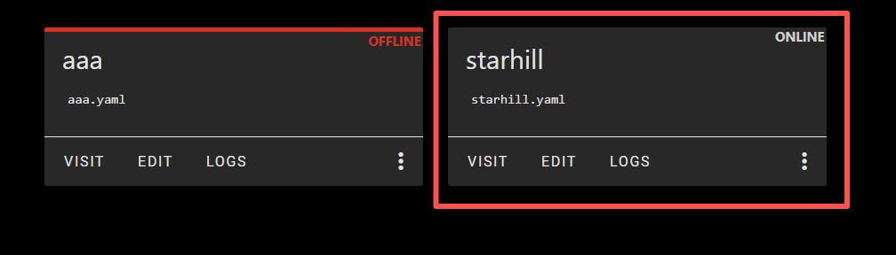

点击 VISIT ，进入 esp32s3 的设备界面,显示数据，如果是两个NA，则去yaml把DHT11的IO改为你自己板子上接DHT11的GPIO
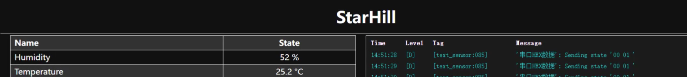

## !!!注意 下面的说明比上述的所有内容都重要!!!

这里选择一个大标题来说明问题的严重性，以下每一个点都很重要，不看算你牛逼

1.首先这个环境第一次搭建并不困难，可以说是丝滑，没有网络卡顿等待带来的一系列问题，如果在上述的某一步骤卡住了，选择手机热点是你的第一选择，随后是重启虚拟机中的HAOS

2.如果HAOS再使用的时候出现了连接不上github,不要使用VMware的桥接网络，继续使用NET,有的时候主机使用全局魔法管用

3.如果你在重启HAOS的时候，进入到了第三个选项(启动后的几秒钟会闪出来一个选择启动配置的东东)，则会等待很长很长的时间，如果你发现启动和第一次安装的时候不一样，速度不重要，是HAOS自己会选择启动的配置，配置不是第一个的话，重装HAOS是短期内最好的选择

4.如果你选择了重装，这才是鬼敲门的开始，你不可以重装一个相同版本的vmdk，比如本文的第二大章选用的是16.2 rc1的版本，你如果选择重装相同版本的的vmdk，可以安装上，但是你会永久的卡在浏览器输入ip后的 《等待20分钟或者更长时间》我称这二十分钟为鬼打墙，你会一直等20分钟，除非你是时间老人，此时上述的《热点大法》《全局魔法》都不好用，反正我一晚上就成功了一次，这里建议换个版本的vmdk，16.0或者16.1都可以，版本不是最新的也无所谓

# 感谢观看


